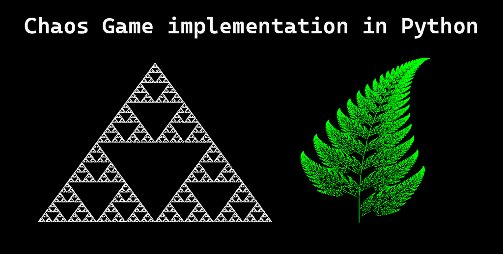
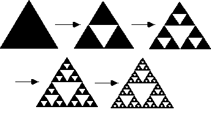
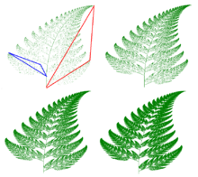

# Chaos Game implementation in Python

## Description
This is a simple framework implementation of the Chaos Game in PyGame. The Chaos Game is a mathematical game that simulates the process of a trajectory of a point subject to non-linear iterative function systems. The game is played by plotting a point at a random position in a square and then iteratively moving the point halfway towards one of the vertices of a polygon, randomly chosen from a given set of vertices. The vertices are fixed for a given polygon, and do not change position. The polygon used in this implementation is a triangle, but it can be easily changed to any other polygon.

The Chaos Game is a form of dynamical system. The game can be extended to higher dimensions by using a regular polyhedron or even a higher-dimensional polytope as the space to move in, and a set of non-linear functions. The game can also be played with a circle instead of a polygon.

This library only supports PyGame for visualization, but it can be easily extended to other frameworks.

## Usage
With inheriting ChaosGameGraphic abstract class, you can create new shapes. The only thing you need to do is to implement the abstract methods. You can also change the number of iterations and the size of the window in the main.py file.
ChaosGameGraphic class follows the Iterator design pattern. It is used to iterate over the vertices of the polygon. The iterator is implemented in the Polygon class.

With inheriting GraphicDrawer abstract class, you can create new graphic drawers. The only thing you need to do is to implement the abstract methods. You can also change the number of iterations and the size of the window in the main.py file.

PygameGraphicDrawer is a concrete implementation of GraphicDrawer abstract class. It uses PyGame to draw the points on the screen.

## Built-in shapes
### Sierpinski triangle
Sierpinski triangle is a fractal and attractive fixed set with the overall shape of an equilateral triangle, subdivided recursively into smaller equilateral triangles. Originally constructed as a curve, this is one of the basic examples of self-similar sets, i.e., it is a mathematically generated pattern that can be reproducible at any magnification or reduction. It is named after the Polish mathematician Wacław Sierpiński, but appeared as a decorative pattern many centuries prior to the work of Sierpiński.

### Barnsley fern
The Barnsley fern is a fractal named after the British mathematician Michael Barnsley who first described it in his book Fractals Everywhere. He made it to resemble the black spleenwort, Asplenium adiantum-nigrum. The "stem" of the fern is created by the graph of the equation

